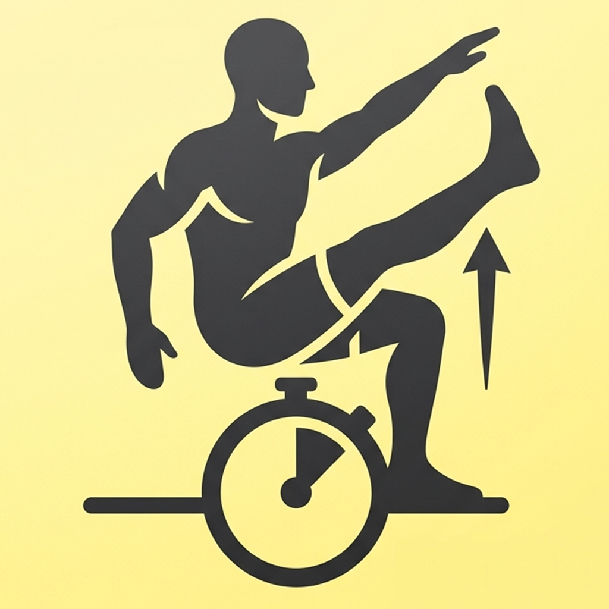

  

# IsoTimer

**A simple isometric exercise timer built around a 90-second progressive contraction.**

[Launch IsoTimer](https://markmcla74.github.io/isotimer/)

---

# Instructions & Info

## How IsoTimer Works

IsoTimer is designed around a **90-second progressive isometric contraction**:

### 30 Seconds — Moderate

Begin with a controlled, moderate contraction.

### 30 Seconds — Strong

Gradually increase the intensity.

### 30 Seconds — Maximum

Finish with your strongest controlled effort.

The approach is based on the isometric training methodology taught by **Steve Maxwell**.

---
## Using the Delay Between Exercises

The **Delay 30**, **Delay 60**, and **Delay 90** buttons can also be used as timed recovery periods between exercises.

A shorter, controlled recovery keeps you moving from one exercise to the next rather than waiting until your heart rate has completely returned to rest.

This allows a series of isometric exercises to become a more continuous workout, combining the isometric contractions with a cardiovascular conditioning component.

Choose the recovery period according to the exercise, your conditioning, and how you feel. **There is no need to rush the recovery.**

---

## See Isometric Exercising in Action

### Steve Maxwell — Isometric Wall Seat

A practical demonstration of an isometric exercise:

**[Watch on YouTube](https://www.youtube.com/watch?v=8Xfk5UhR1I4)**

You can also see Steve Maxwell discussing and demonstrating isometric training here:

**[Watch on YouTube](https://www.youtube.com/watch?v=S3_SRGV9-1U&t=302s)**

---

## A Note About Intensity

**"Maximum" doesn't mean forcing yourself through pain.**

Work at an intensity appropriate for your experience and physical condition. If you experience sharp or unusual pain, back off rather than trying to push through it.

---

## Go Further

### Steve Maxwell — Why I Like Isometrics

Steve explains his approach to isometric training, including the principles behind prolonged, progressively harder contractions.

**[Read the article →](https://www.maxwellsc.com/blog/621u1kez7bwmm68oz6rk5te2wgx2d0)**

### Drew Baye — Timed Static Contraction Training

Drew Baye's book on Timed Static Contractions is an excellent additional resource for anyone interested in this approach.

**[Timed Static Contraction Training — eBook →](https://drewbaye.myshopify.com/collections/digital-books-courses/products/timed-static-contraction-training-ebook)**

---

## Equipment for Overcoming Isometrics

Here are two examples of equipment that can be useful for overcoming isometric exercises:

<table>
  <tr>
    <td><strong>Forearm Forklift Lifting Straps</strong></td>
    <td>
      <a href="https://www.amazon.com/Furniture-Moving-Straps-2-Person-Appliances/dp/B008ASBLJI/">
        View on Amazon →
      </a>
    </td>
  </tr>
  <tr>
    <td><strong>WorldFit ISO Trainer</strong></td>
    <td>
      <a href="https://www.amazon.com/WorldFit-ISO-Trainer-Isometric-Stretching/dp/B07MJM62ZD/">
        View on Amazon →
      </a>
    </td>
  </tr>
</table>

These are examples rather than requirements. Many isometric exercises can be performed without specialized equipment.

---

## Install the PWA

IsoTimer can feel just like a native app when installed on your phone using the browser's **Add to Home Screen** or **Install App** feature.

### 📱 iPhone — Safari

Tap the **Share** button, scroll down, and tap **Add to Home Screen**.

### 🤖 Android — Chrome

Tap the **three dots** in the top right, then tap **Add to Home Screen** or **Install app**.

Once installed, IsoTimer has its own icon on your home screen and can be launched like any other app.

---

## Google Play

IsoTimer is also available as a free Android app.

**[Get IsoTimer on Google Play →](https://play.google.com/store/apps/details?id=com.markmcla.isotimer)**

---

## Make It Your Own

IsoTimer is a deliberately simple **Progressive Web App**. The complete source code is available here on GitHub.
**[Source Code →](https://github.com/markmcla74/isotimer/tree/main)**

If you'd like a timer with different intervals, colors, sounds, terminology, or a completely different exercise protocol, **fork this repository and modify it as you wish.**

You don't need to start from scratch. The existing HTML, CSS, JavaScript, and PWA manifest provide a working foundation that you can customize for your own needs.

**That's one of the reasons this project is open source: if the timer isn't quite right for you, change it.**
